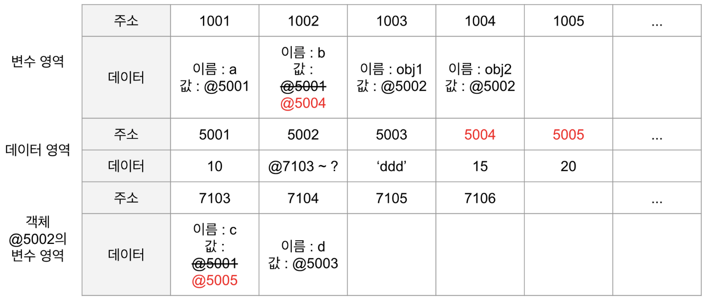

# JavaScript 첫걸음
이 장에서 다룰 것
1. 자바스크립트란 무엇인가? : 브라우저 환경에서 실행되는 인터프리터 언어
2. 자바스크립트는 어떻게 생겼는가?
3. 자바스크립트는 무엇을 할 수 있는가? 와 같은 핵심적인 질문에 답할 것이다.
그 다음 변수, 문자열, 숫자, 배열과 같은 핵심적인 단위를 상세히 논의 해볼 것이다. 

4. 원시타입, 객체타입
먼저, javascript에서는, 데이터의 타입이 원시타입(primitive type)과 객체타입(reference type)으로 나뉜다.
- 원시타입: 변수에 원시타입의 값을 할당하면, 변수(확보된 메모리 공간) 실제 값이 저장된다.
- 객체타입: 변수에 객체타입의 값을 할당하면, 변수(확보된 메모리 공간)에 참조 값이 저장된다. 

```ts
let a = 10;
let b = a;

let obj1 = { c: 10, d: 'ddd' };
let obj2 = obj1;

b = 15;
obj2.c = 20;

// 원시타입의 결과
//a -> 10
//b -> 15
// 참조타입의 결과
//obj1 -> { c: 20, d: 'ddd' }
//obj2 -> { c: 20, d: 'ddd' }
```
)

5. 얕은복사, 깊은복사
- 


6. call by value, call by ref


오늘 목표에 충실하자.
1. object 부분 한번 쭉 읽기
2. 소희에게 컴포넌트 변경된 부분 소개 받기 0
   1. 변경된 것이 무엇인지 정리해 보기
      1. 새로운 자료구조가 추가되었다. 색상종류 > 상태 > 배경색,색 
      2. 이 자료 구조로 이루어진 초기 데이터가 선택한 색과 상태에 따라 버튼의 색상을 결정하고,  styleColor라는 속성을 통해 이 색상 데이터셋을 재정의 할 수 있다
      3. style, styleColor 속성을 반응형구문 안에서 들어온 값을 할당하는데, 이때 object.assign()을 사용한다. object.assign(a,b)는 b를 a에 얕은 복사하여, a를 반환한다. 
      4. 인풋에 추가되어야 하는 요소들
         1. 아이콘 다양하게 받기
         2. 인풋 컴포넌트에도 새로운 자료구조 적용하기. 색상종류 > 상태(호버,선택,기본) > 배경색,선색,색