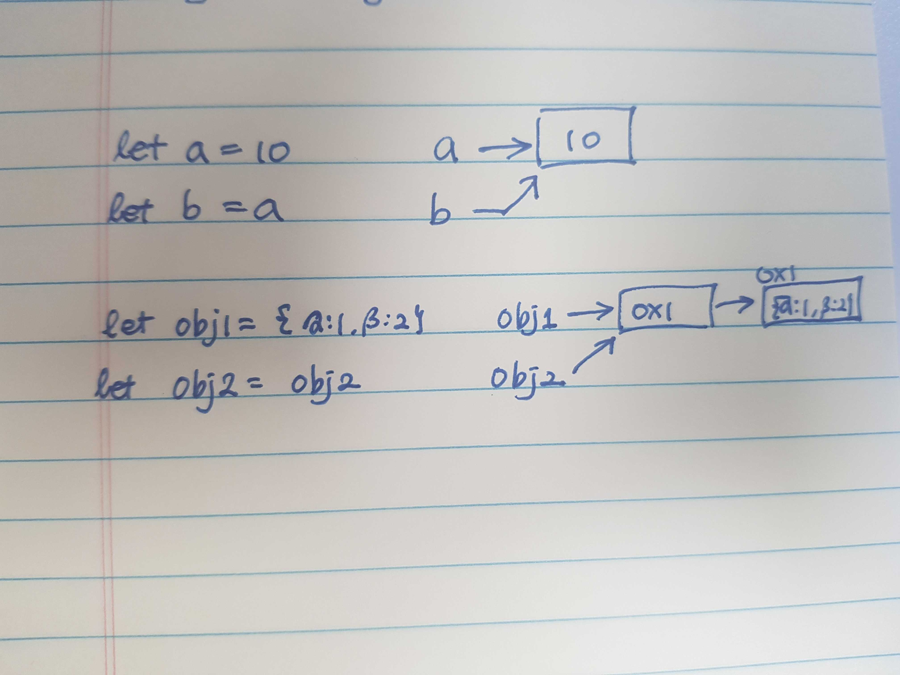
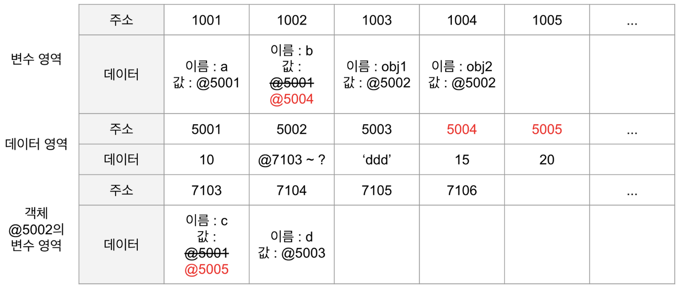

# JS의 데이터 형과 원시타입의 불변성

### 1. 원시타입과 객체타입   
javascript에서는, 데이터의 타입이 원시타입(primitive type)과 객체타입(reference type)으로 나뉜다.
- 원시타입: 변수에 원시타입의 값을 할당하면, 변수(확보된 메모리 공간) 실제 값이 저장된다.
- 객체타입: 변수에 객체타입의 값을 할당하면, 변수(확보된 메모리 공간)에 참조 값이 저장된다. 

```ts
let a = 10;
let b = a;

let obj1 = { c: 10, d: 'ddd' };
let obj2 = obj1;

b = 15;
obj2.c = 20;

// 원시타입의 결과
//a -> 10
//b -> 15 
// 참조타입의 결과
//obj1 -> { c: 20, d: 'ddd' }
//obj2 -> { c: 20, d: 'ddd' }
```
 

---   

### 2. 원시타입의 불변성 
#### 원시타입값을 수정할 수 없다는 의미다. 주의! 원시타입값을 할당받은 변수 식별자에 재할당을 할 수 없다는 의미가 아니다. 원시타입은 변수형이 아니라 데이터형, 값의 형태임을 기억하자.