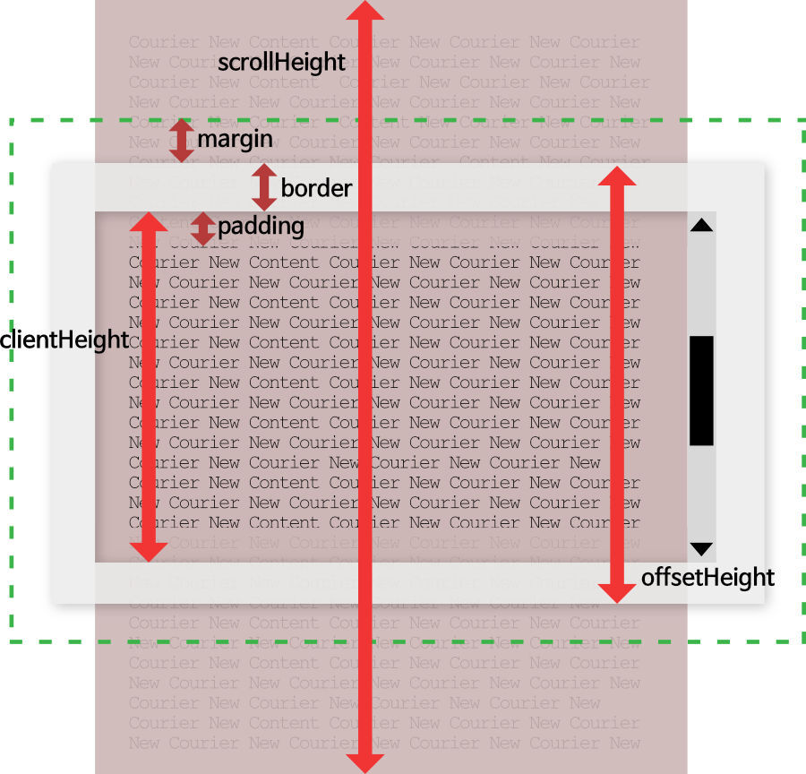

# height
- 요소의 높이를 지정해주는 css 속성이다. box-sizing이 content-box 일때는 요소의 높이를 결정해 주지만, border-box일 경우에는 padding 과 border을 포함한 높이를 결정한다.
- min-height 와 max-height 는 height를 덮어쓴다

## height의 value들
- auto(default): 브라우저가 요소의 높이를 계산하고 선택  //궁금쓰
- length: 절대 높이
- percentage: 부모에 대한 상대적인 높이
- initial: 이 속성의 default로 지정해주기. 즉 auto
- inherit: 부모의 속성 물려 받기
- - max-content: 본질적으로(?) 선호하는 높이
- - min-content: 본질적인 최소 높이
- - fit-content: getmax(min-content, max-height, 사용가능한 다른 높이들)
- - available: padding, border을 제외한 컨턴츠 영역의 높이 지정

## height와 같은 css dimension(치수) properties
- height
- max-height
- min-height
- width
- max-width
- min-width

> 이미지 출처: https://blogpack.tistory.com/706

> 참조
> https://developer.mozilla.org/en-US/docs/Web/API/CSS_Object_Model/Determining_the_dimensions_of_elements
> https://www.w3schools.com/cssref/pr_dim_height.asp
> https://developer.mozilla.org/ko/docs/Web/CSS/height