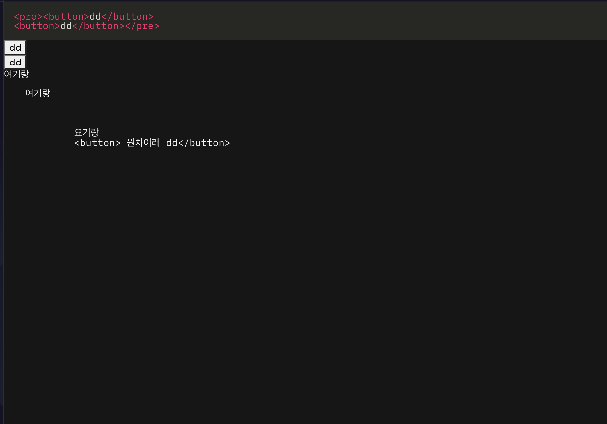

# highlight
- 이 패키지는, 코드를 문자열로 전달을 하면, 코드가 쓰여진 문법에 따라 단어들의 색을 문법에 맞게 바꾸어준다.
- 이 패키지는 설치하고 아래의 코드 처럼 사용하면 끝난다.
- 이 패키지에서 pre 태크와 code태그를 사용하고 있으므로, 문자열에 띄어쓰기, 줄바꿈이 모두 그대로 화면에 그려진다.
```ts
<script lang="ts">
	import { setGlobalPending } from '@src/components-global/store';
	setGlobalPending(false, 0);
	import Highlight from 'svelte-highlight';
	import xml from 'svelte-highlight/languages/xml';
	import monokai from 'svelte-highlight/styles/monokai';
	let code = `<pre><button>dd</button>
<button>dd</button></pre>`;
</script>

<svelte:head> // html head에 내용을 추가해준다
	{@html monokai} // highlight 테마
</svelte:head>

<Highlight language={xml} {code}/>

{@html code} //html코드 문자열 code를 실제 html요소로 그려준다.

<div>
	<!-- 여기는 안나옴 -->
	여기랑
	<pre>
        <!-- 여기 빈칸 그대로 나옴 -->
        여기랑
        <!-- 여기 빈칸 그대로 나옴 -->
        <code>
            <!-- 여기 빈칸 그대로 나옴 -->
            요기랑 
            &lt;button&gt; 뭔차이래 dd&lt;/button&gt;
        </code>
    </pre>
</div>

```

